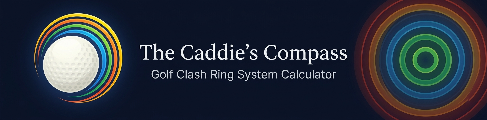
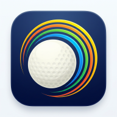

<p align="center">
  
</p>

<h3 align="center">Master the Golf Clash Ring System</h3>

<p align="center">
  A free, fast, tap-first <strong>Golf Clash ring system calculator</strong> and wind chart builder.<br/>
  Build your bag. Set your levels. Read your ring adjustments. Land the shot.
</p>

<p align="center">
  <a href="https://gcn.kielbyrne.com"><strong>🌐 Use it now →</strong></a>&nbsp;&nbsp;·&nbsp;&nbsp;
  <a href="#-what-is-the-ring-system">Ring System Explained</a>&nbsp;&nbsp;·&nbsp;&nbsp;
  <a href="#-features">Features</a>&nbsp;&nbsp;·&nbsp;&nbsp;
  <a href="#%EF%B8%8F-how-the-math-works">How It Works</a>
</p>

<p align="center">
  
  
  
  
</p>

---

## 🎯 What Is the Ring System?

The **Golf Clash ring system** (also called the **ring method**) is the most widely used technique for compensating for wind in Golf Clash.

Here's the core idea: each **power ring** on your target circle represents a specific amount of wind your club can cancel. By counting rings and adjusting your aim into the wind, you land shots with pinpoint accuracy — even in 15+ mph crosswinds.

The catch? The wind-per-ring value is different for **every club**, at **every level**, at **every power setting** (max, mid, min). Calculating it by hand is tedious. That's what this tool automates.

### How ring adjustments work

```
Wind Speed ÷ Wind Per Ring = Rings to Adjust
```

For example, if the wind is **10 mph** and your club's wind-per-ring at max power is **2.5**:

```
10 ÷ 2.5 = 4 rings into the wind
```

The Caddie's Compass calculates the wind-per-ring and rings-per-wind values for every club in your bag, instantly, at any level.

---

## ✨ Features

### 🏌️ Bag Builder
Pick your Golf Clash clubs from a complete, categorized grid — **Drivers**, **Woods**, **Long Irons**, **Short Irons**, **Wedges**, **Rough Irons**, and **Sand Wedges**. Tap to add, tap to remove.

### 📊 Ring System Calculator
The chart updates **live** as you build your bag and adjust levels. Toggle between two views:

| View | What it shows |
|------|--------------|
| **Wind Per Ring** | How much wind each additional power ring cancels out |
| **Rings Per Wind** | How many rings to adjust for a given wind speed (1–16 mph) |

Both views show values for **Max**, **Mid**, and **Min** power.

### 🎚️ Level Sliders
Set each club's level to match your in-game loadout. The ring adjustment values recalculate instantly — no page reload, no submit button.

### 🧮 Shot Calculator
Dial in the **exact wind speed** and **wind angle** for your current shot. The calculator shows the precise ring adjustment and a visual compass overlay. Supports **elevation correction** for uphill/downhill shots.

### 🏀 Ball Power Modes
Switch between **Power 0** through **Power 5** ball modes. Each mode applies a power coefficient that shifts the ring adjustment values.

### 💾 Bag Profiles
Save multiple bag configurations (e.g., "Tour Bag", "Tournament Bag", "Par 3 Bag") and switch between them instantly.

### 🔗 Shareable Bag Links
Generate a URL that encodes your entire bag + levels. Share it in your clan chat, and they see your exact setup.

### 📱 Widget Mode
A compact view designed for **split-screen play** — keep the calculator visible alongside Golf Clash on your phone or tablet.

### 🖨️ Print / Save PDF
One-click print layout generates a clean wind chart you can print, screenshot, or save as PDF.

### 🌓 Dark & Light Themes
Auto-detects your system preference, or manually toggle between light and dark.

### 📲 Installable PWA
Install it from your browser — works offline on iOS, Android, and desktop. No app store needed.

### ⚙️ Club Editor
Golf Clash reworks clubs regularly. The built-in editor lets you:
- **Add** new clubs with custom power/accuracy stats
- **Edit** any existing club's stats, category, or rarity
- **Delete** removed or reworked clubs
- **Import/Export** your club database as JSON

---

## 🚀 Quick Start

### Use it online (recommended)

**→ [gcn.kielbyrne.com](https://gcn.kielbyrne.com)**

Works instantly in any modern browser. Install it as an app from your browser's menu for offline access.

### Run it locally

```bash
git clone https://github.com/Kiel-H-Byrne/gcn2.git
cd gcn2
npm install
npm run dev
```

Open `http://localhost:5173` in your browser.

---

## 🏗️ How to Use

1. **Pick your clubs** — Tap clubs from the grid to add them to your bag
2. **Set the levels** — Slide or tap to match your in-game club levels
3. **Read your ring adjustments** — The ring system chart updates instantly

That's it. No accounts, no signups, no ads.

### Pro tips

- Use **Widget Mode** for split-screen play on mobile
- **Save bag profiles** so you can switch between tour and tournament setups
- **Share your bag** by copying the URL — it encodes your clubs + levels
- **Print the chart** and tape it next to your monitor for quick reference

---

## ⚙️ How the Math Works

The wind calculation engine is a from-scratch JavaScript port of the wind-adjustment formula published by the [golf-clash-notebook](https://github.com/golf-clash-notebook/golf-clash-notebook.github.io) project (MIT licensed).

### The ring system formula

Each club's **power** and **accuracy** stats at a given level determine the **wind-per-ring** value:

```
Wind Per Ring = f(accuracy, power, category_multiplier, power_mode)
```

Where:
- **Accuracy** determines the base size of the target rings
- **Power** is normalized against the category's max carry distance
- **Category multiplier** accounts for how different club types interact with wind (e.g., Rough Irons at 1.45×, Sand Wedges at 1.15×)
- **Power mode** applies ball power coefficients (Power 0 = 1.0×, Power 5 = 1.13×)

The formula computes separate values for **max**, **mid**, and **min** power:

| Power Level | Description |
|-------------|-------------|
| **Max** | Full power swing — smallest ring adjustment |
| **Mid** | Halfway between min and max power |
| **Min** | Minimum power — largest ring adjustment, most sensitive to wind |

> **Note:** This model covers power and accuracy only. It does not account for elevation, curl, spin, or the Magnus effect. Treat the numbers as a strong estimate, not gospel.

### Special cases

- **Half-swing clubs** (Wedges, Rough Irons, Sand Wedges): Min power is ¼ of max; mid is ½ of max
- **B52 & Grizzly**: Level 5+ gets a 0.9× correction for max-power wind resistance
- **Elevation**: An elevation percentage shifts the effective power, altering ring values

---

## 📂 Project Structure

```
├── index.html              → Entry point with SEO, structured data, FAQ schema
├── vite.config.js           → Vite + React + PWA configuration
├── public/
│   ├── pwa-192x192.png      → App icon (192px)
│   ├── pwa-512x512.png      → App icon (512px)
│   ├── robots.txt           → Search engine crawl directives
│   └── sitemap.xml          → XML sitemap for search indexing
└── src/
    ├── main.jsx             → React entry point + PWA registration
    ├── App.jsx              → Root component and layout
    ├── styles.css            → All styling (light/dark via CSS variables)
    ├── utils.js              → Shared utilities
    ├── lib/
    │   └── wind.js          → Ring system math engine (no DOM dependencies)
    ├── data/
    │   ├── clubs.js         → Starter club dataset
    │   └── balls.js         → Ball power mode definitions
    ├── hooks/
    │   └── useApp.js        → App state management hook
    └── components/
        ├── Header.jsx       → Branding, widget mode toggle, theme selector
        ├── ClubGrid.jsx     → Club selection grid by category
        ├── BagPanel.jsx     → Your bag sidebar + profiles
        ├── ChartControls.jsx → Chart type, mode, title, notes
        ├── ChartOutput.jsx  → Wind chart tables (screen + print layouts)
        ├── ShotCalculator.jsx → Live shot calculator with compass dial
        ├── ClubEditorModal.jsx → Add/edit/delete/import/export clubs
        ├── WidgetView.jsx   → Compact split-screen mode
        ├── FullscreenOverlay.jsx → Fullscreen chart view
        ├── Footer.jsx       → Attribution and links
        └── ui/              → Chakra UI provider configuration
```

---

## 🔧 Tech Stack

| Layer | Technology |
|-------|-----------|
| **Framework** | React 19 |
| **UI Library** | Chakra UI v3 |
| **Build Tool** | Vite 8 |
| **Icons** | Lucide React |
| **PWA** | vite-plugin-pwa (Workbox) |
| **Styling** | CSS custom properties (light/dark themes) |
| **State** | React hooks + localStorage persistence |

---

## 🤝 Contributing

Contributions are welcome! Here are some ways you can help:

- **Update club stats** — When Playdemic releases balance patches, club stats change. Use the in-app editor or submit a PR updating `src/data/clubs.js`
- **Report bugs** — [Open an issue](https://github.com/Kiel-H-Byrne/gcn2/issues)
- **Suggest features** — Ideas for improving the ring system calculator? Open a discussion
- **Spread the word** — Share the tool in your Golf Clash clan, Reddit, Discord, or Facebook groups

---

## 📖 FAQ

<details>
<summary><strong>What is the Golf Clash ring system?</strong></summary>

The Golf Clash ring system (also called the ring method) is a technique for adjusting your aim to compensate for wind. Each power ring on the target circle represents a specific amount of wind a club can cancel. By counting rings and moving your target into the wind, you can land shots precisely even in heavy wind. The number of rings depends on your club's accuracy and power stats, the power level you hit at, and the wind speed.
</details>

<details>
<summary><strong>How do I use the ring system in Golf Clash?</strong></summary>

1. Check the wind speed and direction on screen
2. Look up your club's wind-per-ring value for the power level you plan to hit (The Caddie's Compass calculates this automatically)
3. Divide the wind speed by the wind-per-ring value to get the number of rings
4. Move your target that many rings into the wind

Example: Wind is 10 mph, wind-per-ring is 2.5 → move 4 rings into the wind.
</details>

<details>
<summary><strong>Is this tool free?</strong></summary>

Yes. The Caddie's Compass is completely free, has no ads, and requires no account or signup. It's an open-source project.
</details>

<details>
<summary><strong>Does it work offline?</strong></summary>

Yes. Install it as a PWA from your browser and it works fully offline — perfect for areas with spotty reception on the golf course (real or virtual).
</details>

<details>
<summary><strong>How do I update club stats after a Golf Clash update?</strong></summary>

Use the **Club Editor** (⚙️ button) in the app to add, edit, or delete clubs. Your changes are saved to localStorage and layered on top of the built-in dataset. You can also import/export your club data as JSON.
</details>

<details>
<summary><strong>What clubs does this support?</strong></summary>

All of them. The starter dataset includes every club from Golf Clash: Apoc, Thor's Hammer, Endbringer, Spitfire, Tsunami, B52, Falcon, Hornet, Thorn, Sniper, Guardian, Cataclysm, and many more. You can add any new clubs via the editor.
</details>

---

## ⚖️ License

ISC — see [LICENSE](LICENSE) for details.

## ⚠️ Disclaimer

This project is **not affiliated with Playdemic, EA, or Golf Clash**. Club data is sourced from the [golf-clash-notebook](https://github.com/golf-clash-notebook/golf-clash-notebook.github.io) community project (MIT licensed). Golf Clash is a trademark of Playdemic Ltd.

---

<p align="center">
  <a href="https://gcn.kielbyrne.com">
    
  </a>
  <br/>
  <strong><a href="https://gcn.kielbyrne.com">Try The Caddie's Compass →</a></strong>
  <br/>
  <sub>Built for the Golf Clash community. Master the ring system. Land every shot.</sub>
</p>
